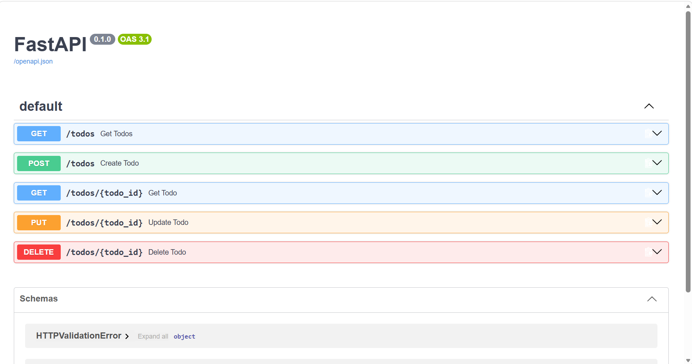

# FastAPI PostgreSQL Todo API

A RESTful Todo API built using **FastAPI**, **PostgreSQL**, and **Pydantic**.  
The project demonstrates backend API development, database integration, CRUD operations, input validation, environment-based configuration, and Git version control.

## Tech Stack

- Python
- FastAPI
- PostgreSQL
- Psycopg2
- Pydantic
- Uvicorn
- python-dotenv
- Git & GitHub

## Features

- Create a new todo
- Retrieve all todos
- Retrieve a todo by ID
- Update an existing todo
- Delete a todo
- PostgreSQL database integration
- Pydantic request validation
- HTTP error handling
- Environment variables for database credentials
- Automatic Swagger API documentation

## Project Structure

```text
todo-api/
│
├── main.py
├── requirements.txt
├── .env.example
├── .gitignore
└── README.md
```
## API Documentation

FastAPI automatically generates interactive Swagger UI documentation for testing the API endpoints.

